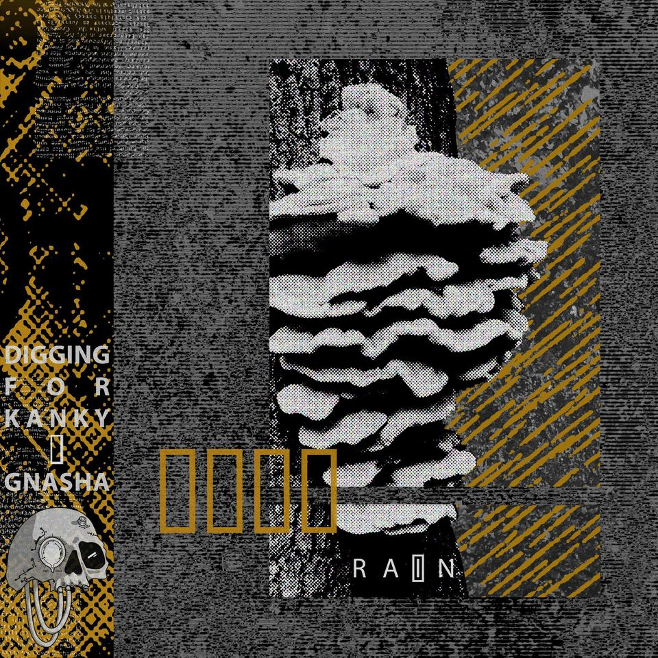
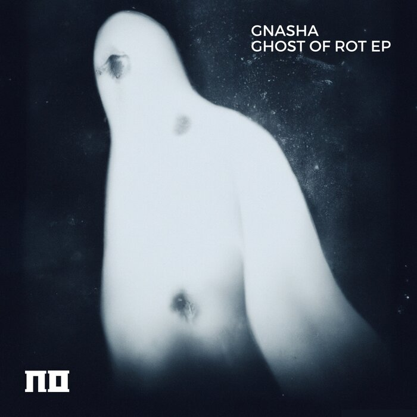
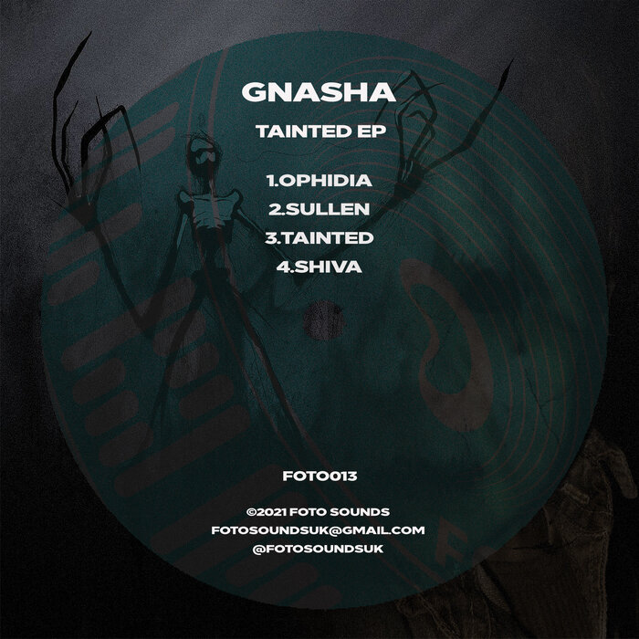
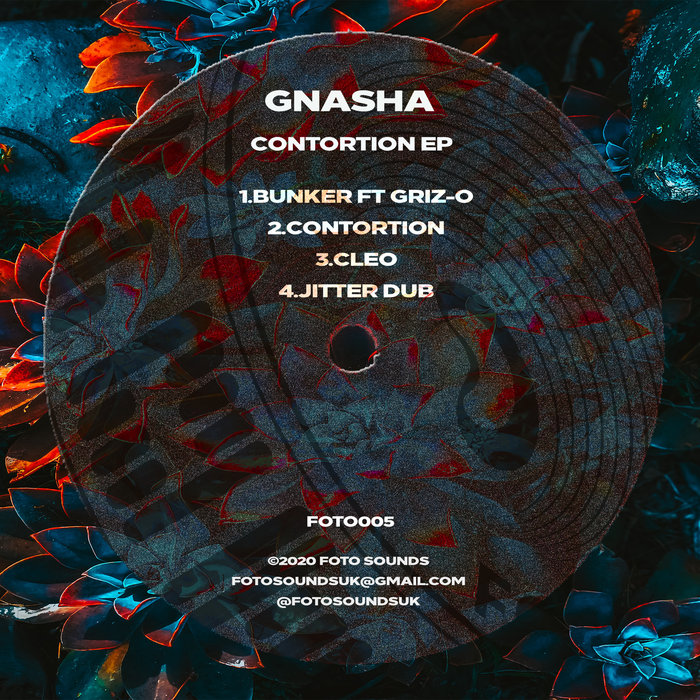

<h2><mark style="background-color: lightgrey;">GNASHA - OMINOUS</mark> </h2> 
DUPLOC OFF LIMITS / 1
DUPLOC
2024

<iframe style="border-radius:12px" src="https://open.spotify.com/embed/track/0g2LvDOpwEtEjDs0JRutAZ?utm_source=generator&theme=0" width="100%" height="152" frameBorder="0" allowfullscreen="" allow="autoplay; clipboard-write; encrypted-media; fullscreen; picture-in-picture" loading="lazy"></iframe>

**Played by**: Juno Recommends Dubstep
**Review**: The Duploc reign of intensity continues to do the business as the crew once again assembled here for a vibrant 10 track collection, showcasing some of the hardest hitting producers across the dubstep spectrum today. Featuring the likes of Gnasha with her gnarly creation 'Ominous', along with 11th Hour, Oddkut, Hotcut, Quasar, JSM & more, it's a truly stacked collection of artists to say the least. Our highlights would have to include the slightly quirky woodwind slides and steadily crunching bass notation of Conzi's 'Word', along with the nostalgia-inducing industrialism of Die By The Sword's 'Til Death' original. A hard hitting box of weaponry, no less than we would expect from such a prestigious imprint.

<h2><mark style="background-color: lightgrey;">Digging for Kanky, Gnasha - Rain</mark> </h2> 
Rain
Black Pollen Records
2024

<iframe style="border-radius:12px" src="https://open.spotify.com/embed/track/6DUGdWKUwyXDmhpFbUWAkr?utm_source=generator&theme=0" width="100%" height="152" frameBorder="0" allowfullscreen="" allow="autoplay; clipboard-write; encrypted-media; fullscreen; picture-in-picture" loading="lazy"></iframe>

**Review**: North Manchester-based experimental hip-hop duo Digging for Kanky comprising Ben and Smithy. The duo got their moniker from a mythical local grave robber named 'Old Kanky' in the 1800s, but luckily for us, these guys are not desecrating graves but are thrilling fans with an edgy and off-kilter take on rap.

Their latest release "Rain" is a brooding and hair-raising track comprising cinematic textures, and triumphant horns that evoke trepidation and fear like the coming of a sinister force from the shadows. The track is produced by Manchester's beat maestro Gnasha who laces the boys with the perfect canvas to showcase their unadulterated lyricism to the forefront.

The track is one of many coming from Digging for Kanky and Gnasha as they are currently working on their collaborative project set to be released via Black Pollen Records.

<h2><mark style="background-color: lightgrey;">Enigma Dubz & Gnasha</mark> </h2> 
#Heaters VIPs
Morii
2023

<iframe style="border-radius:12px" src="https://open.spotify.com/embed/album/2sktnAoCWSRUZiCvG1VVoT?utm_source=generator&theme=0" width="100%" height="152" frameBorder="0" allowfullscreen="" allow="autoplay; clipboard-write; encrypted-media; fullscreen; picture-in-picture" loading="lazy"></iframe>

**Played by**: Juno Recommends Dubstep
**Review**: Next up from the incredible ENiGMA Dubz, one final outing before the Christmas cut off as he joins forces with four of dubstep's finest troopers for the '#Heaters VIPs', giving some feisty original collaborations a 2023 touch up. First up, MYTHM takes centre stage on the 'No Fear' VIP mix, giving it an even more gnarly overwash, before ENiGMA steps out on remix duty himself, giving the thunderous subs and digitised fx of 'You Trippin' from himself and Bommer a tasty overhaul. Next, Gnasha lands on VIP duty for 'Earthworm, delivering syncopated drum pops and hard hitting bass crunches, before Wraz unloads one final weighty blow on the 'Dune Buggy' rethink, focussing heavily on earth-shattering synths and steadily evolving LFO runs. Awesome work from all involved!

<h2><mark style="background-color: lightgrey;">Gnasha - Ghost of Rot EP</mark> </h2> 
Ghost of Rot EP
Nomine Sound
2023

<iframe style="border-radius:12px" src="https://open.spotify.com/embed/album/21a7qJY7WoIjimhpjUv4mS?utm_source=generator&theme=0" width="100%" height="152" frameBorder="0" allowfullscreen="" allow="autoplay; clipboard-write; encrypted-media; fullscreen; picture-in-picture" loading="lazy"></iframe>

**Played by**: Juno Recommends Dubstep

<h2><mark style="background-color: lightgrey;">Gnasha - Somnipathy</mark> </h2> 
Infernal Sounds Presents: Future Forms
Infernal Sounds
2023

<iframe style="border-radius:12px" src="https://open.spotify.com/embed/track/0igWJ992LVFaTIEYQg4kxK?utm_source=generator&theme=0" width="100%" height="152" frameBorder="0" allowfullscreen="" allow="autoplay; clipboard-write; encrypted-media; fullscreen; picture-in-picture" loading="lazy"></iframe>

**Played by**: Juno Recommends Dubstep, NAZA
**Review**: As one of the most undeniably consistent dubstep imprints of 2022, we are thrilled to see the Infernal Sounds crew turning the heat up right from the start of the year as they deliver a mega compilation project, featuring 17 absolute sizzlers. The range that Infernal Sounds are able to deliver is very apparent across this project from start to finish, from the otherworldly chord shimmers of Conzi's 'Drift' to the more sublow synthesiser sweeps of 'Executioner' from Blottarz and all the way back to the intricate percussive mastery of Bisweed's 'By My Side'. It's an all star cast, with the likes of Mistah, Substrada, Dayzero, Gnasha, Kodama and more all providing heavy hitters, with our favourites including E S P's super spooky whirlpool entitled 'Open Mind', next to Saraphim's super smooth 'Cool Box' original.

<h2><mark style="background-color: lightgrey;">Gnasha - Tainted EP</mark> </h2> 
Tainted EP
Foto Sounds
2021

<iframe style="border-radius:12px" src="https://open.spotify.com/embed/album/5CG1rc4NGZFIwTqGkfrEmS?utm_source=generator&theme=0" width="100%" height="152" frameBorder="0" allowfullscreen="" allow="autoplay; clipboard-write; encrypted-media; fullscreen; picture-in-picture" loading="lazy"></iframe>

**Played by**: NAZA, Tik&Borrow
**Review**: Following on from a slight hiatus, it's great to see Gnasha back at it again, joining forces with the Foto Sounds team for a grizzly four track experience. Right from the jump we are plunged into the deep end with this one as 'Ophidia' delivers a gut-busting float through subby abandon and breathy woodwind, before the more traditional reesey pulses and choppy drum structures of 'Sullen' give us a wonderful contrast only two tracks in. We then leap back into the abstract almost immediately as the unique bass plucks and futuristic drum chops of 'Tainted' once again send our headtops spinning across the dance, landing next to a sizzling outro in 'Shiva'. This one utilizes eastern-style melodic arrangement with another truckload of synthetic sub power to put the finishing decoration on a magnificent original dubstep selection.

<h2><mark style="background-color: lightgrey;">Gnasha - Contortion EP</mark> </h2> 
Contortion EP
Foto Sounds
2020

<iframe style="border-radius:12px" src="https://open.spotify.com/embed/album/5IxIVjSAKjjMpH4csqoPQ2?utm_source=generator&theme=0" width="100%" height="152" frameBorder="0" allowfullscreen="" allow="autoplay; clipboard-write; encrypted-media; fullscreen; picture-in-picture" loading="lazy"></iframe>

**Played by**: Juno Recommends Dubstep, Tik&Borrow